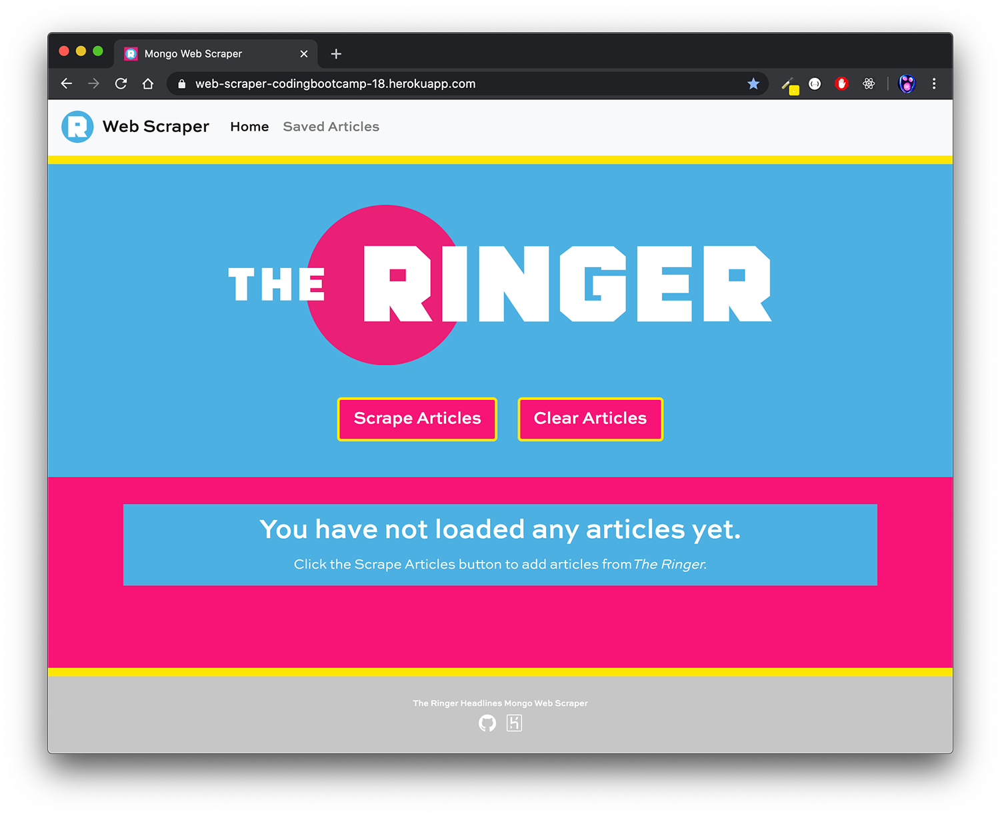
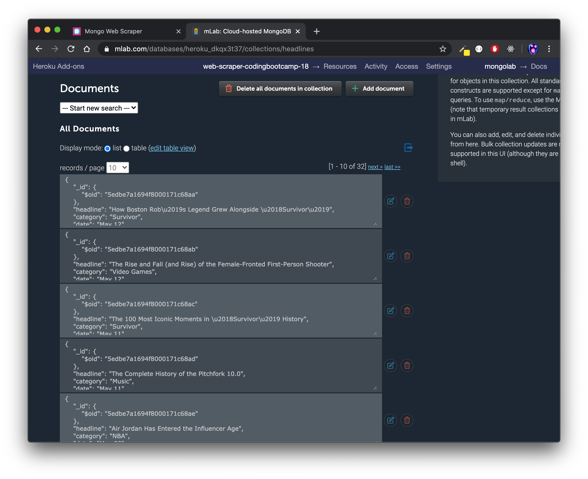
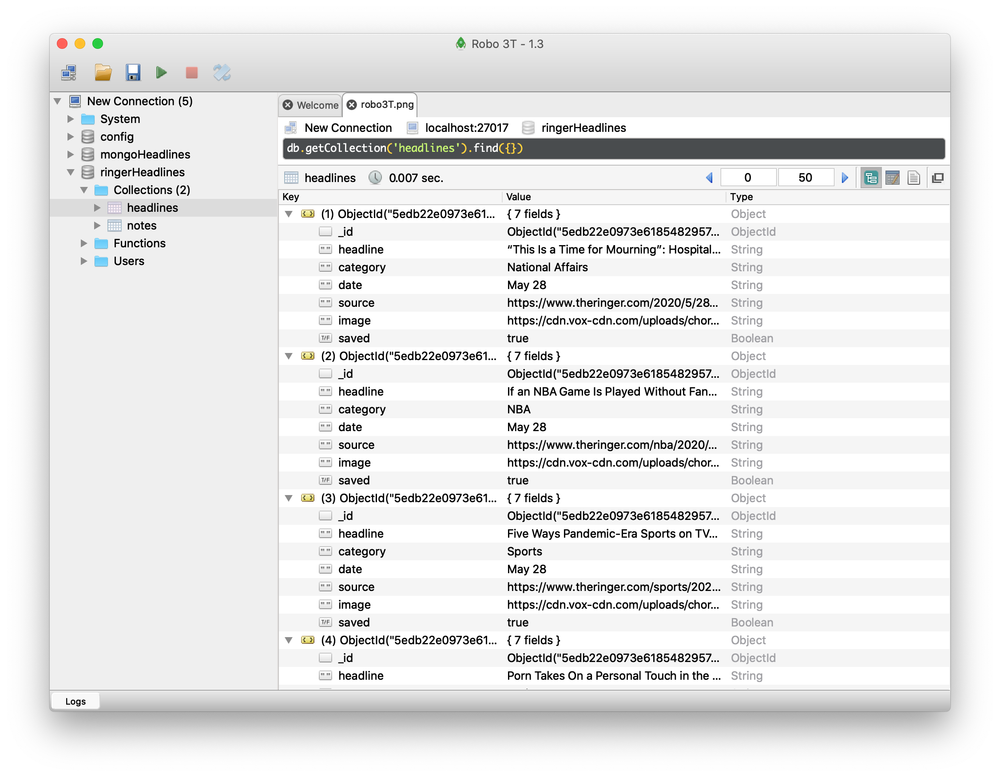

**Mongo Web Scraper**
======


UTA-VIRT-FSF-PT-01-2020-U-LOL&nbsp;&nbsp;&nbsp;|&nbsp;&nbsp;&nbsp;Homework #18&nbsp;&nbsp;&nbsp;|&nbsp;&nbsp;&nbsp;Ashley Allphin

> ### Deployed to Heroku [here](https://web-scraper-codingbootcamp-18.herokuapp.com/).




# Overview

This `Node.js` and `MongoDB` app utilizes `cheerio` to scrape headlines from [The Ringer](www.theringer.com/features).  Articles are returned to the page with options to save and post notes.

## Dependencies

   1. `express`

   2. `express-handlebars`

   3. `mongoose`

   4. `cheerio`

   5. `axios`

<br>

# Functionality

## Backend

On the backend, the app uses `express` to serve routes and `mongoose` to interact with a Mongo database.


```js
// If deployed, use the deployed database. Otherwise, use the local ringerHeadlines database.

var MONGODB_URI = process.env.MONGODB_URI || "mongodb://localhost/ringerHeadlines";

mongoose.connect(MONGODB_URI);
```

This code creates a `mongoose` connection via mLab MongoDB Heroku add-on if deployed, but otherwise will connect to the local database mongoHeadlines collection.

<br>

*Deployed database*
*Localhost database*

## Frontend

On the frontend, the app uses `handlebars` for HTML templating and Bootstrap as a styling framework. `jQuery` and `AJAX` are used to post articles and notes to the pages.


>*Scraping articles*
><!-- blank line -->
>


>*Saving and deleting articles*
><!-- blank line -->
>


>*Posting and deleting notes*
><!-- blank line -->
>

<br>

## Additional Features to Implement in the Future
- Add a clear all articles button and function.
- Ability to add note without closing modal.
- Further style buttons.